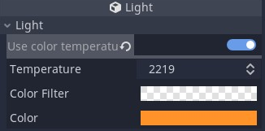

# Godot Light Tools

## Available Tools:

### Light Color temperature

Uses Tanner Helland's [color temperature to RGB algorithm](https://tannerhelland.com/2012/09/18/convert-temperature-rgb-algorithm-code.html) to calculate the light color.

Editor works with all `Light` inheriting classes (in 3D, `DirectionalLight`, `OmniLight`, `SpotLight`) and `Light2D` nodes.

The editor is optional and can be disabled on a per Light basis. Additional color filtering is supported using Godots [`Color.blend` function](https://docs.godotengine.org/en/3.3/classes/class_color.html#class-color-method-blend). Use the alpha value the control the amount of filtered light.

The color temperature is an editor only tool as the resulting light color is saved. All other values (temperature, filter, and tool enabled state) are saved as meta data and remain even if the tool is disabled.

#### Planned features

A light type preset button with following values:
| Temperature | Light Source |
| --- | --- |
| **1500 K** | **Candle** |
| 2000 K | Sodium-vapor lamp |
| 2600 K | Incandescent light bulb (40 W) |
| **2700 K** | **Incandescent light bulb (60 W)** |
| 2800 K | Incandescent light bulb (100 W) |
| 3000 K | Incandescent light bulb (200 W) |
| 3200 K | halogen incandescent lamp |
| **3400 K** | **late evening sun shortly before dawn** |
| 3600 K | Operating room lighting |
| 4000 K | fluorescent lamp (neutral white) |
| **4120 K** | **Moon** |
| 4500 K | Xenon lamp |
| 5000 K | Morning/evening sun |
| **5500 K** | **morning/afternoon sunlight** |
| 5800 K | Midday sun, overcast |
| **6500 K** | **LCD white** |
| **7000 K** | **Overcast sky** |
| **8000 K** | **Fog, heavy haze** |
| **10000 K** | **Blue (cloudless) sky on shaded north side** |
| **20000 K** | **Clear blue, northern sky light** |